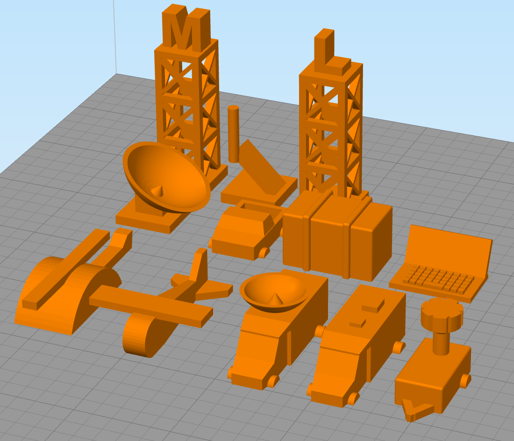

Pieces for the communications game that you can 3D print yourself. The pieces
were created in OpenSCAD 2015.03-2 and have some variables for size mods.

The list of pieces, if they are complete, and how many need to be printed.
Unless otherwise noted supports should not be enabled.

# Hex Pieces
- [x] CELL - Cell Tower (x8)
- [x] LMR - Land Mobile Radio Tower (x4)
- [x] FIRE - Fire Station (x4)
- [x] AIR - Airport (x1)
- [x] SCH - School (x5)
- [x] POLC - Police Station (x3)
- [x] EOC - Emergency Operations Center (x1)
- [x] HOSP - Hospital (x3)
- [x] PSAP - Public Safety Answering Point (x2)
- [x] CO - Central Office (x1)
- [x] MSC - Mobile Switching Center (x2)

# Resources
- [x] BGAN (x15)
- [x] COW (x10)
- [x] Satellite Phone (x30) - May require supports
- [ ] Helicopter (x2)
- [x] Microwave Tower (x5)
- [x] LMR Tower (x5)
- [x] Satellite Cellular on Light Truck (x5)
- [ ] VSAT (x12)
- [x] RV (x10)
- [x] Truck (x10)
- [x] Radio Cache
- [ ] sUAS

